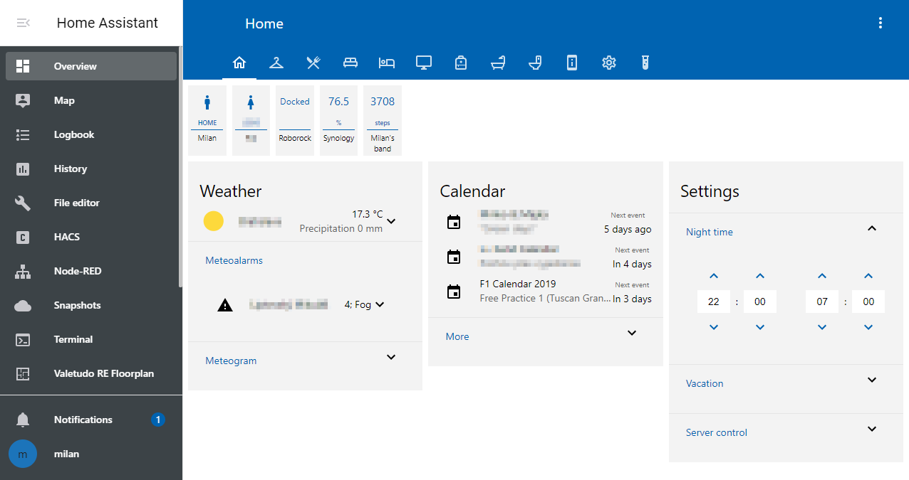
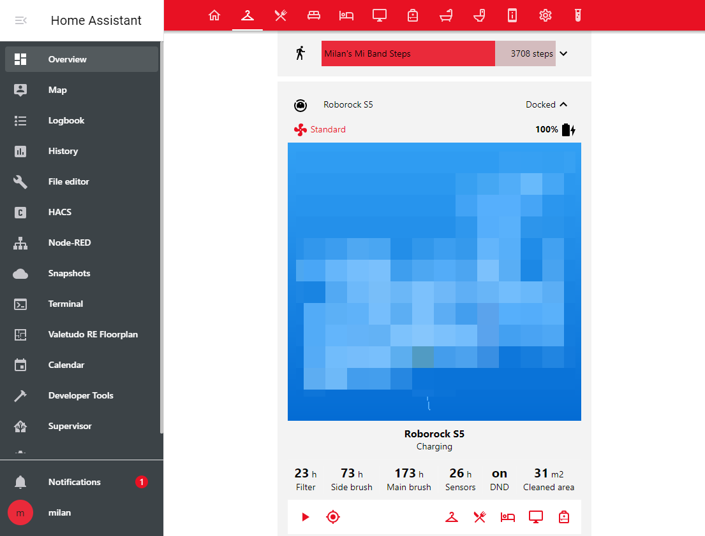
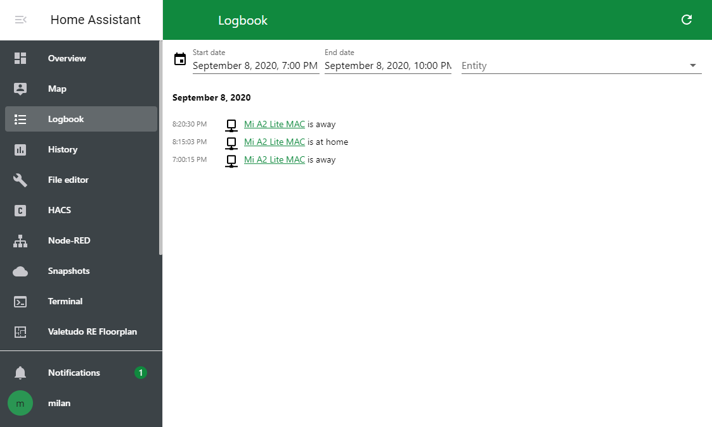
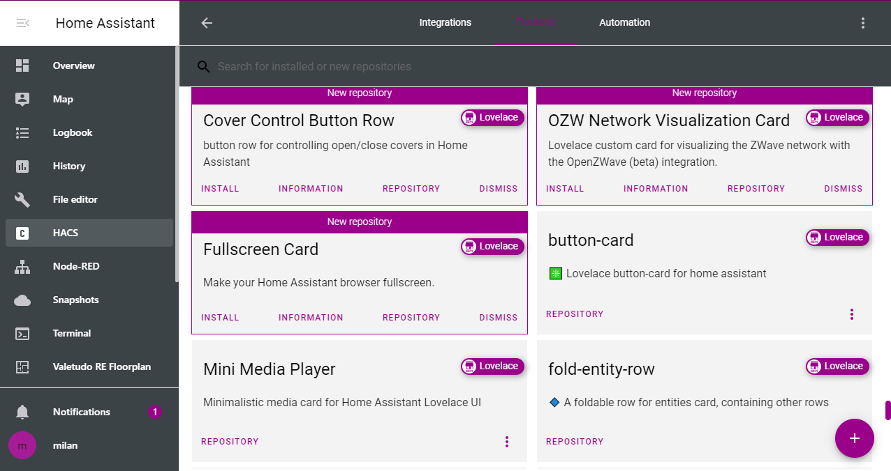
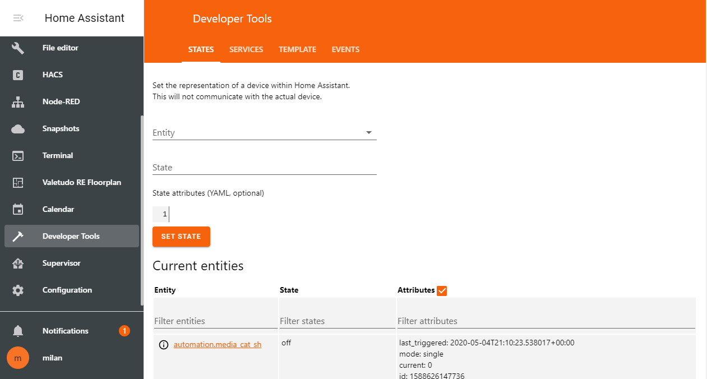
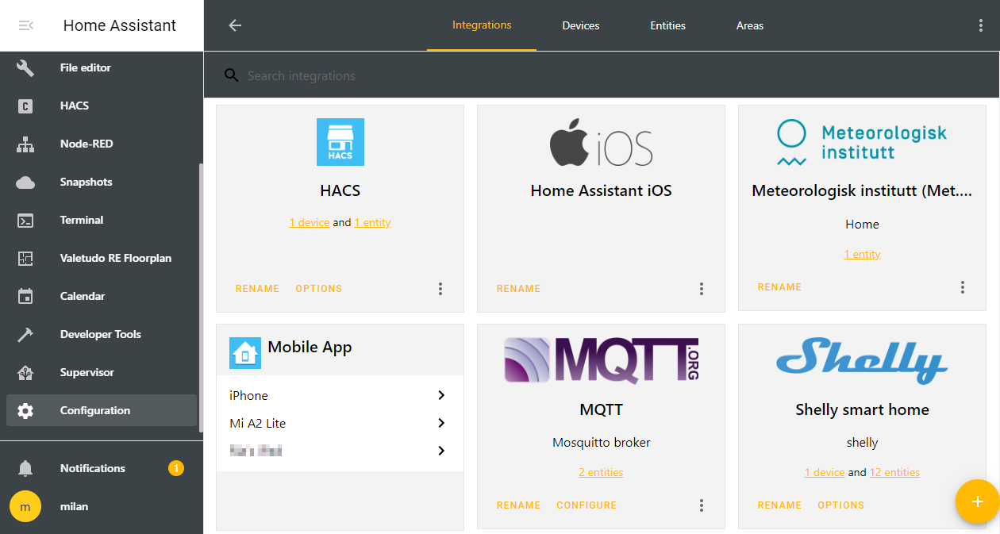

# Home Assistant Windows 10 inspired themes

> By Milan Korenica - mikosoft83

Here are 23 themes based on Windows 10 look. All the themes are the same apart for accent color. All the colors are taken straight from W10 accent color picker and UI elements. 

## New version!

Added styling for:

- HACS
- [Bar card](https://github.com/custom-cards/bar-card) (available also in HACS)
- [Time picker](https://github.com/GeorgeSG/lovelace-time-picker-card) (also in HACS)

And now the themes are also supercharged using [card-mod](https://github.com/thomasloven/lovelace-card-mod)! Elements styled are:

- Badges
- Fonts
- More info dialog
- [Vacuum card](https://github.com/denysdovhan/vacuum-card) by Denys Dovhan

I highly recommend installing card-mod (available in HACS) to fully embrace this theme.

## Screenshots













## Caveats

The theme doesn't play well with some elements (e.g. search in HACS, some tabbed headers). I couldn't find any style variables to change that. If anyone knows how to do that feel free to open an issue or a pull request.

## TODO

- Acrylic
0 Dark theme

## Installation

Add the following code to your `configuration.yaml` file (reboot required).

```yaml
frontend:
  ... # your configuration.
  themes: !include_dir_merge_named themes
  ... # your configuration.
```
### HACS (not yet)

1. Go to the Community Store.
2. Search for `Windows 10`.
3. Navigate to `Windows 10` theme.
4. Press `Install`.
6. Go to services and trigger the `frontend.reload_themes` service.

### Manual

Clone this repository in your existing (or create it) `themes/` folder.

```bash
cd themes/
git clone https://github.com/home-assistant-community-themes/template.git
```

Or using submodules:

```bash
cd themes/
git submodule add https://github.com/home-assistant-community-themes/template.git
```
