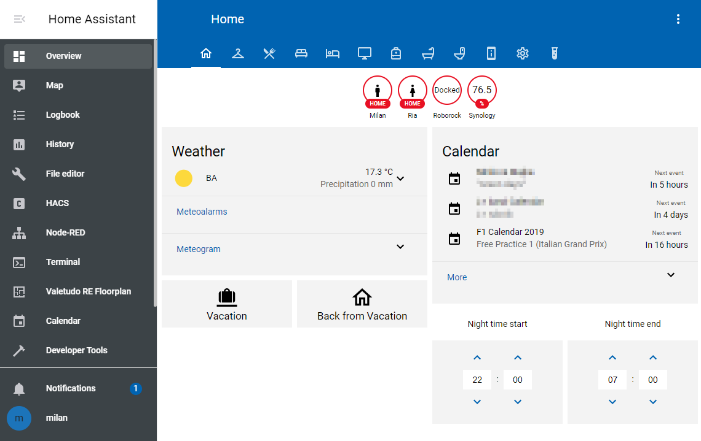
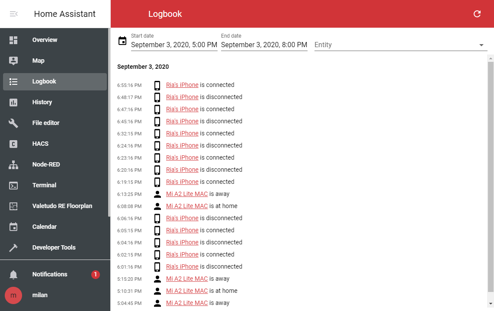
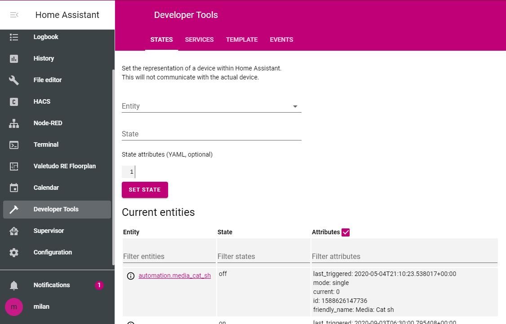
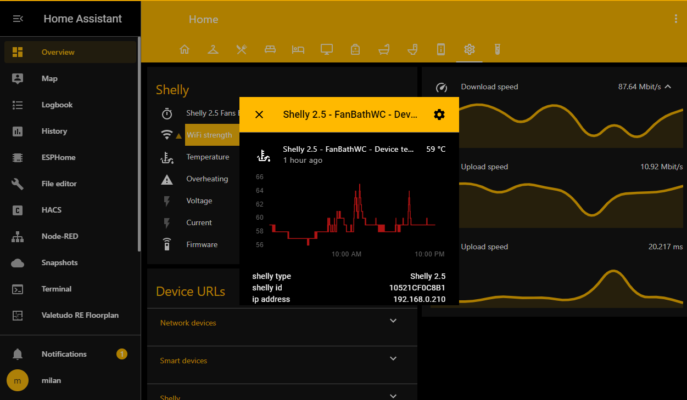
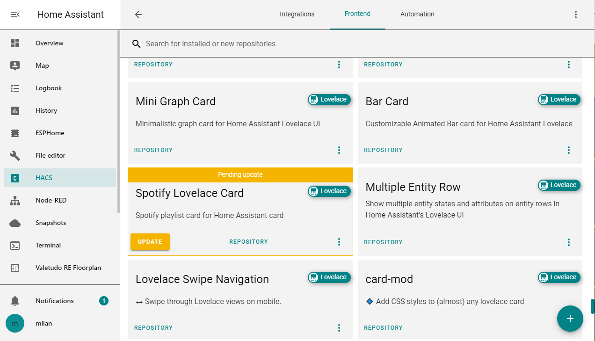
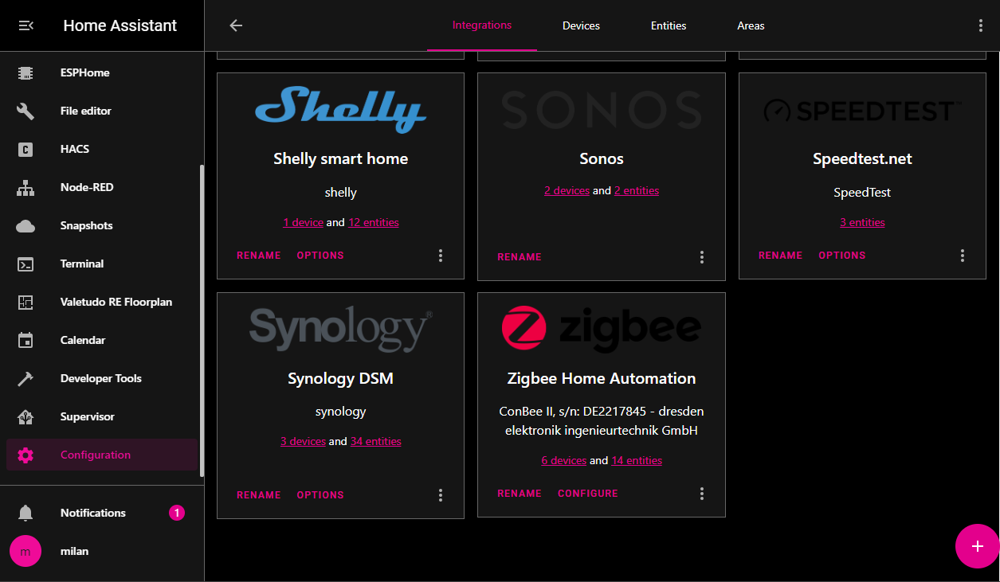

# Home Assistant Windows 10 inspired themes

> By Milan Korenica - mikosoft83

Here are 49 themes based on Windows 10 look. All the themes are the same apart for accent color and support light/dark mode selection (if you are using HA version older than 2021.6 only light mode will be available). All the colors are taken straight from Windows 10 accent color picker and UI elements. 

Themes style:

- [HACS](https://hacs.xyz/)
- [Bar card](https://github.com/custom-cards/bar-card) (available also in HACS)
- [Time picker](https://github.com/GeorgeSG/lovelace-time-picker-card) (also in HACS)

Themes are supercharged using [card-mod](https://github.com/thomasloven/lovelace-card-mod)! Elements styled are:

- Badges
- Fonts
- More info dialog
- [Vacuum card](https://github.com/denysdovhan/vacuum-card) by Denys Dovhan
- [Mini graph card](https://github.com/kalkih/mini-graph-card) by kalkih

I highly recommend installing card-mod (available in HACS) to fully embrace this theme.

## Screenshots














## TODO

- Acrylic

## Installation

Add the following code to your `configuration.yaml` file (reboot required).

```yaml
frontend:
  ... # your configuration.
  themes: !include_dir_merge_named themes
  ... # your configuration.
```
### HACS

1. Go to the Community Store.
2. Search for `Windows 10`.
3. Navigate to `Windows 10` theme.
4. Press `Install`.
6. Go to services and trigger the `frontend.reload_themes` service.

### Manual

Clone this repository in your existing (or create it) `themes/` folder.

```bash
cd themes/
git clone https://github.com/home-assistant-community-themes/template.git
```

Or using submodules:

```bash
cd themes/
git submodule add https://github.com/home-assistant-community-themes/template.git
```
